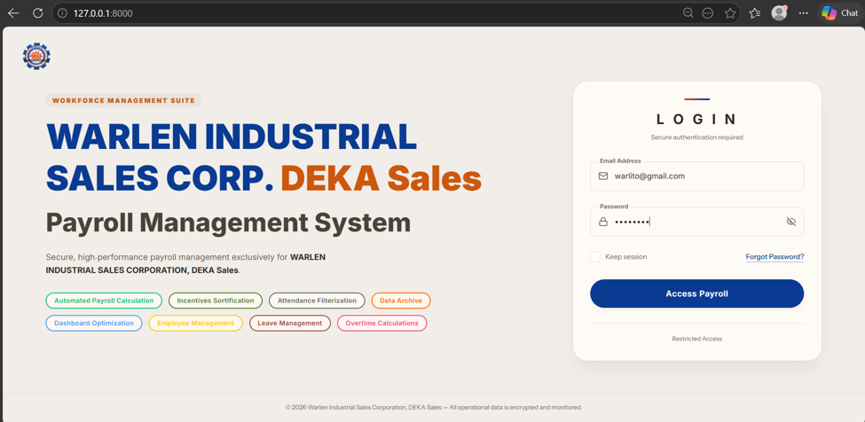
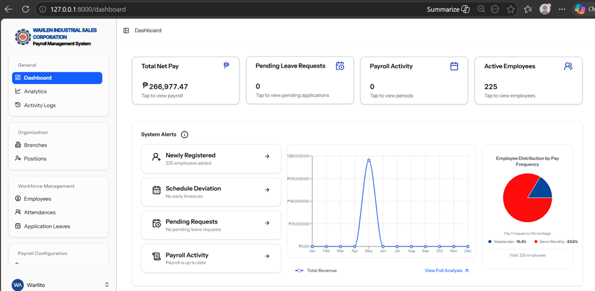
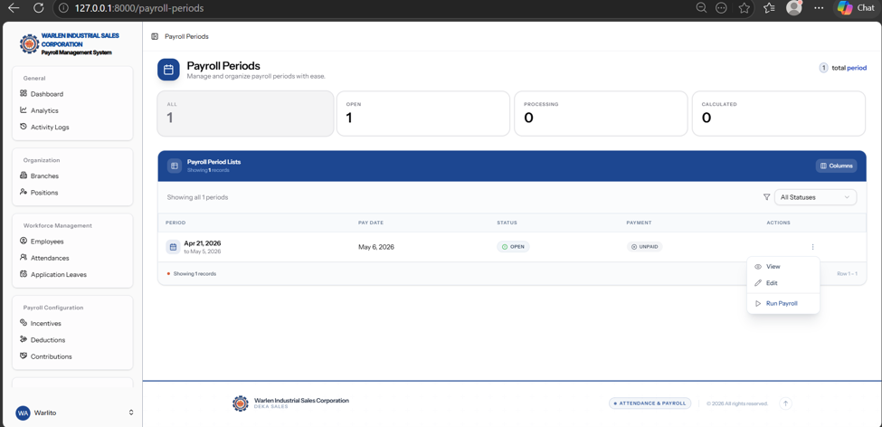

# Payroll Management System – Warlen Industrial Sales Corporation

> A robust, real-time payroll management solution built for Warlen Industrial Sales Corporation, designed to automate salary computations, track attendance, and streamline payroll approvals with live updates.

## Overview

This system is a comprehensive payroll management platform developed specifically for Warlen Industrial Sales Corporation. It automates the entire payroll lifecycle, including employee attendance tracking, leave management, salary calculations, tax and deduction computations, and payslip generation. 

Leveraging WebSocket technology, the system provides **real-time monitoring** of attendance logs and instant payroll approval notifications, ensuring that management and employees always have up-to-the-second information. The backend is built for high reliability and data integrity using PostgreSQL.

## My Role

**Backend Programmer**  
- Architected the entire backend architecture, including database schema design, business logic, and API development.  
- Designed and implemented a **PostgreSQL database** with optimized schemas for employees, attendance, leaves, salaries, deductions, and payroll runs.  
- Developed complex payroll computation algorithms to handle overtime, late deductions, taxes, and government-mandated contributions.  
- Implemented **WebSocket broadcasting** (Laravel Reverb/Pusher) for real-time attendance tracking, payroll status updates, and instant notifications to managers and employees.  
- Built secure authentication and role-based access control (Admin, HR, Payroll Staff, Employee).  
- Created scalable RESTful endpoints and server-side rendering logic using **Laravel & Inertia.js**.  
- Integrated queue workers for bulk payroll processing and email report generation.  
- Ensured data consistency, ACID compliance, and high performance for financial transactions.

## Technology Stack

| Layer          | Technologies |
|----------------|--------------|
| **Backend**    | Laravel (PHP) – Business logic, APIs, Queue Management |
| **Frontend**   | React.js + Inertia.js (Server-side rendering & SPA) – **RILT Stack** |
| **Styling**    | Tailwind CSS – Utility-first UI components |
| **Database**   | PostgreSQL – ACID-compliant relational database for financial data |
| **Real-Time**  | Laravel Reverb / Pusher – WebSocket for live attendance & approval updates |
| **Queue**      | Redis / Database – For background job processing (payroll batches, emails) |
| **Dev Tools**  | Composer, NPM, Vite, Git, Artisan Tinker |

**Screenshots:**

*Figure 1: Secure Authentication / Login Page*

*Figure 2: Payroll Dashboard – Total Net Pay, Employee Distribution, Payroll Activity*

*Figure 3: Payroll Periods Management – View, Edit, and Run Payroll*

## Key Features

### 👥 Employee Management
- Full employee profile management (personal info, salary grade, tax status).
- Role-based access control (Admin, HR, Manager, Employee).

### ⏱️ Attendance & Timekeeping
- Real-time attendance logging via web interface.
- WebSocket-powered live dashboard for HR to monitor check-ins/outs instantly.
- Overtime and undertime computation integrated with payroll.

### 💰 Payroll Computation Engine
- Automated monthly salary calculations based on attendance, leaves, and overtime.
- Handles complex deductions (SSS, PhilHealth, Pag-IBIG, Withholding Tax).
- Support for bonuses, allowances, and reimbursements.
- Bulk payroll processing with background queues.

### 📨 Real-Time Notifications
- Live WebSocket notifications for payroll approval, payslip release, and attendance irregularities.
- Email alerts for payroll completion and payslip generation.